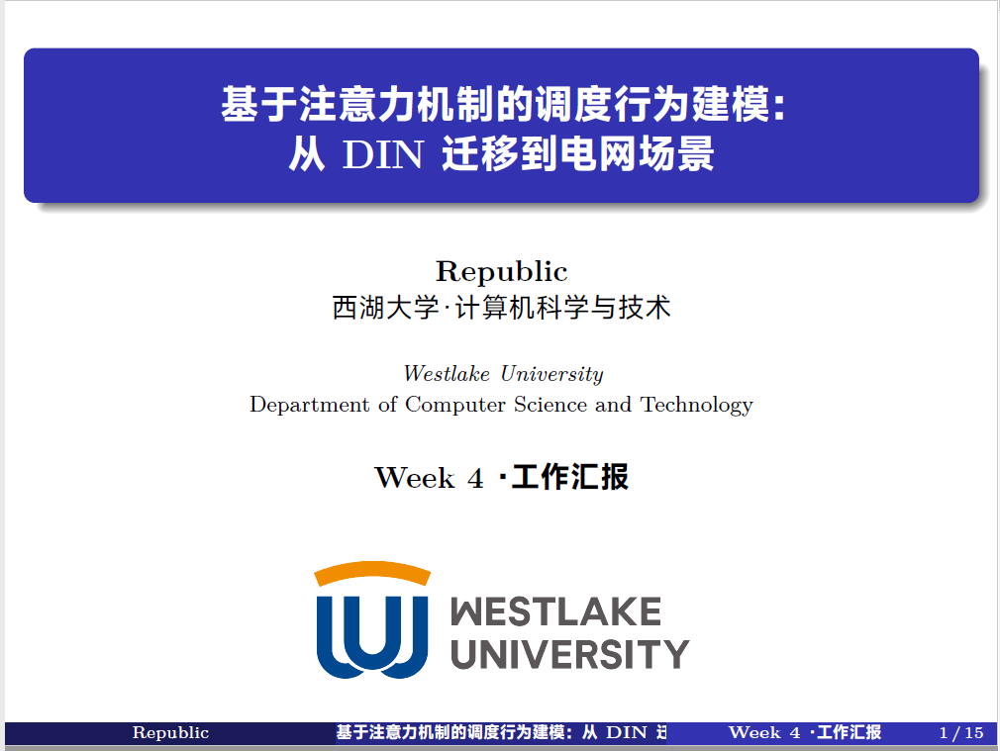
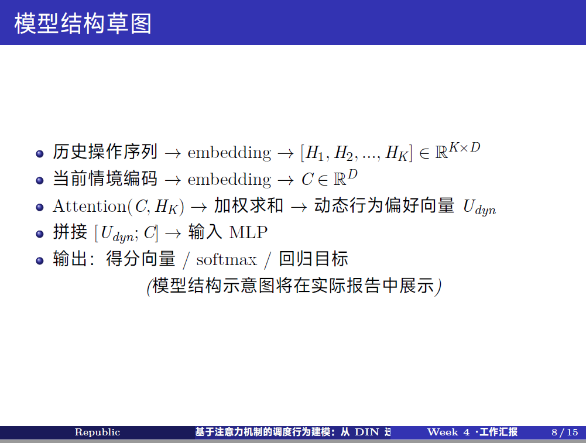

# 西湖大学 Beamer 模板

本仓库提供了一个简洁、轻量、正式的 **Beamer** 演示文稿模板，适用于 **西湖大学**（Westlake University）相关学术汇报、课程展示或项目介绍。

该模板基于：
- `Madrid` 主题
- Serif 字体风格
- 完整支持 **中英文混排与自动换行**
- XeLaTeX 编译模式
- 极简设计风格，去除干扰元素
- 内置数学公式、表格、图像、参考文献支持

## 效果展示




## 特点

- ✅ 中英文自动换行，中文字体采用 MiSans
- ✅ 数学符号、表格、图像模块预设
- ✅ 支持引用与参考文献管理（`natbib`）
- ✅ 自定义标题页，带西湖大学 logo
- ✅ 简洁清晰的章节结构和目录展示
- ✅ 去除导航栏符号，专注内容展示

## 使用方法

1. 请使用 **XeLaTeX** 编译。
2. 如需引用文献，请准备好 `.bib` 文件。
3. 修改标题、作者信息和 logo 图片路径，替换为自己的内容。
4. 根据需要编辑各个章节内容。


## 推荐编译顺序
XeLaTeX → BibTeX → XeLaTeX → XeLaTeX


# Westlake University Beamer Template

This repository provides a clean, lightweight, and professional **Beamer template** for academic presentations at **Westlake University** (西湖大学).

The template is based on:
- `Madrid` theme
- Serif font style
- Full support for **both English and Chinese (auto line breaking)**
- XeLaTeX compilation
- Minimal navigation symbols for a clean look
- Pre-configured for scientific presentations with math, tables, figures, and references support

## Features

- ✅ Chinese and English mixed typesetting (via `xeCJK` and `MiSans` font)
- ✅ Math symbols, tables, and graphics ready
- ✅ Reference management via `natbib`
- ✅ Custom title page with Westlake University logo
- ✅ Clean sectioning and table of contents
- ✅ Minimalist and academic aesthetic

## Usage

1. Make sure you compile with **XeLaTeX**.
2. Prepare your `.bib` file if you need to use citations.
3. Replace the title, author, and logo image with your own information.
4. Start editing the content as needed.

```bash
# Recommended compile steps
XeLaTeX -> BibTeX -> XeLaTeX -> XeLaTeX
